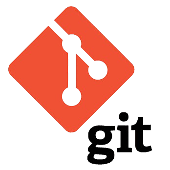

<h1 align="center">Salut, moi c'est Suly ! 👋</h1>

  

  🎓 Étudiant passionné par le développement et les systèmes informatiques. 
  💡 J’aime apprendre, expérimenter et créer des projets concrets. 
  🚀 <b>Actuellement :</b> Je travaille sur des jeux de rôle et des applications de gestion.

<h2 align="center">🔧 Compétences techniques</h2>

<h3 align="center">🌐 Langages & frameworks</h3>

  
  
  
  
  
  
  
  
  

<h3 align="center">🛠️ Outils</h3>

  
  
  
  
  
  
  

<strong>Intérêts</strong> : Développement d’applications, jeux vidéo, gestion de données, réseaux

---

<h2 align=center>📊 Statistiques GitHub</h2>

  

---

<h2 align=center>📌 Projets mis en avant</h2>

  
  

  

---

<h2 align=center>🌐 Me retrouver</h2>

  
  
  

